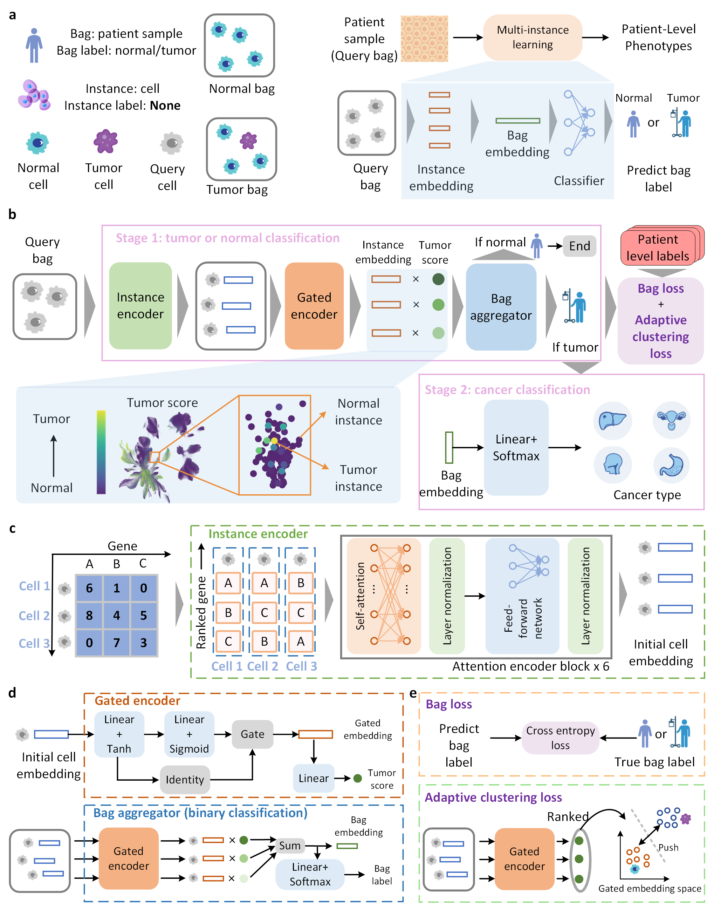

# scTransMIL Bridges Patient and Single-Cell for Cancer Detection

Single-cell sequencing data is bringing about a significant transformation in the clinical diagnosis and research of cancer. However, current artificial intelligence (AI) research in connecting single-cell atlases with patient-level cancer phenotypes is still insufficient, mainly reflected in the challenges of training labels when predicting cancer phenotypes at the single-cell resolution. Therefore, we propose **scTransMIL**, a **sc**RNA-seq **Trans**former-based **M**ulti-**I**nstance **L**earning framework, to learn cell representations covering the whole-genome context and provide cancer-specific insights at the sample, cell, and gene levels.

<p align="center">
  
</p>

## Hardware requirements
`scTransMIL` requires only a standard computer with enough RAM and a NVIDIA GPU to support operations.
We ran the demo using the following specs:

+ CPU: 10 cores, 2.5 GHz/core
+ RAM: 40 GB
+ GPU: NVIDIA TESLA V100

## System requirements
This tool is supported for Linux. The tool has been tested on the following system:

+ CentOS Linux release 8.2.2.2004

## Installation
To install the required packages for running scTransMIL, please use the following command:
```bash
conda create -n <env_name> python==3.10
git lfs install
git clone https://huggingface.co/ctheodoris/Geneformer
pip install .
pip install pyarrow==16.1.*
pip install future
pip install git+https://github.com/oval-group/smooth-topk.git
```

## scTransMIL Pre-training
### Training corpus preprocessing
Download raw data from [Pan-cancer](https://www.nature.com/articles/s41467-024-48310-4), the feature space covers the whole genome:

```bash
all_GSE132509.h5ad          crc_GSE188711.h5ad             gc_GSE167297.h5ad         hn_scc_GSE140042.h5ad             lu_sclc_GSE150766.h5ad       nhl_mf_GSE165623.h5ad               pdac_GSE155698.h5ad       rcc_GSE171306.h5ad
bc_GSE135337.h5ad           crc_HOLee_GSE132257.h5ad       gingiva_hca_byrd.h5ad     hn_scc_GSE164690.h5ad             mel_GSE200218.h5ad           ovary_GSE118127.h5ad                pdac_GSE156405.h5ad       rcc_mendeley.h5ad
bc_GSE192575.h5ad           crc_HOLee_GSE132465.h5ad       gyn_GSE173682.h5ad        intestine_gca.h5ad                mel_uv_GSE138433.h5ad        ov_GSE184880.h5ad                   pdac_GSE214295.h5ad       rcc_scportal.h5ad
bladder_GSE129845.h5ad      crc_HOLee_GSE144735.h5ad       hcc_GSE112271.h5ad        kidney_GSE131685.h5ad             mel_uv_GSE139829.h5ad        ov_GSE213243.h5ad                   pdac_PRJCA001063.h5ad     salivary_GSE188478.h5ad
br_GSE161529.h5ad           crc_meta_GSE178318.h5ad        hcc_GSE149614.h5ad        kidney_hca_stewart.h5ad           mel_uv_GSE176029.h5ad        ov_hgs_GSE154600.h5ad               pr_GSE141445.h5ad         salivary_hca_warner.h5ad
br_GSE176078.h5ad           crc_pan_blueprint.h5ad         hcc_GSE156625.h5ad        liver_hca_macparland.h5ad         mm_PRJNA694128.h5ad          ov_hgs_GSE158937.h5ad               pr_GSE143791.h5ad         sar_ost_GSE152048.h5ad
br_pan_blueprint.h5ad       fallopian_tube_GSE151214.h5ad  hcc_ihcca_GSE125449.h5ad  lu_adc_codeocean.h5ad             nbl_EGAD0000100637.h5ad      ov_hgstoc_pan_blueprint_ovary.h5ad  pr_GSE157703.h5ad         sar_ost_GSE162454.h5ad
br_pdac_GSE179705.h5ad      gbm_EGAS00001002185.h5ad       hcc_ihcca_GSE151530.h5ad  lu_adc_GSE123902.h5ad             net_ginet_GSE140312.h5ad     ov_meta_GSE165897.h5ad              pr_nepc_GSE137829.h5ad    sar_rhab_GSE174376.h5ad
br_tnbc_pan_GSE148673.h5ad  gbm_github.h5ad                hn_GSE195832.h5ad         lu_adc_GSE131907.h5ad             net_pancreas_GSE162708.h5ad  ov_pan_blueprint_ovary.h5ad         prostate_hca_henry.h5ad   sar_sys_GSE131309.h5ad
br_tnbc_PRJEB35405.h5ad     gbm_GSE173278.h5ad             hn_npc_GSE150430.h5ad     lu_adc_GSE146100.h5ad             nhl_ctcl_GSE147944.h5ad      pancreas_GSE183568.h5ad             rcc_EGAS00001002171.h5ad  skin_GSE144236.h5ad
cca_GSE154170.h5ad          gbm_GSE182109.h5ad             hn_npc_GSE150825.h5ad     lu_HRA000154.h5ad                 nhl_cut_GSE173820.h5ad       pan_GSE140819.h5ad                  rcc_GSE152938.h5ad        skin_GSE179162.h5ad
cca_ih_GSE138709.h5ad       gc_egc_GSE134520.h5ad          hn_npc_GSE162025.h5ad     lung_hca_vieira.h5ad              nhl_DLBCL_FL_VRJUNV.h5ad     pdac_GSE141017.h5ad                 rcc_GSE156632.h5ad        tc_GSE191288.h5ad
crc_GSE166555.h5ad          gc_GSE163558.h5ad              hn_oscc_GSE172577.h5ad    lu_nsclc_pan_blueprint_lung.h5ad  nhl_dlbcl_GSE182434.h5ad     pdac_GSE154778.h5ad                 rcc_GSE159115.h5ad        tc_ptc_GSE184362.h5ad
```
Modify the file `1-process_v3.py` in `celldata_pancancer`, set line 54 `flag` from `step1` to `step3` and run the file. You will get the preprocessed dataset:

```bash
├── celldata_pancancer
    ├── tumor_subtyping_dummy_clean_sub.csv
    └── tumor_vs_normal_dummy_clean_sub.csv
    └── tumor_vs_normal_2917_features_sub
    	└── h5ad_files
    	└── input_attn_files
    	└── input_id_files
    	└── tokenized_data
```
Divide the data, the default is 10 fold division. For the binary classification scenario:

```bash
python create_splits_seq.py --task task_1_tumor_vs_normal
```
For the multiple classification scenario:
```bash
python create_splits_seq.py --task task_2_tumor_subtyping
```
### Training
scTransMIL is trained on pan-cancer. For the binary classification scenario:
```bash
python main.py --exp_code pancancer_bicls --weighted_sample --bag_loss ce --inst_loss svm --task task_1_tumor_vs_normal --model_type clam_sb --data_root_dir ./celldata_pancancer
```
For the multiple classification scenario:

```bash
python main.py --exp_code pancancer_multicls --weighted_sample --bag_loss ce --inst_loss svm --task task_2_tumor_subtyping --model_type clam_sb --data_root_dir ./celldata_pancancer
```
### Eval
For the binary classification scenario:

```bash
python eval.py --models_exp_code bicls_pancancer_s1 --save_exp_code bicls_pancancer_s1_cv --task task_1_tumor_vs_normal --model_type clam_sb --results_dir results --data_root_dir ./celldata_pancancer
```

For the multiple classification scenario:

```bash
python eval.py --models_exp_code multicls_pancancer_s1 --save_exp_code multicls_pancancer_s1_cv --task task_2_tumor_subtyping --model_type clam_sb --results_dir results --data_root_dir ./celldata_pancancer
```
Enter the `celldata_pancancer` directory and run `2-bag_eval.py` to check the results:
```bash
cd celldata_pancancer
python 2-bag_eval.py
```
## Model availability
Pre-trained scTransMIL are available on `./results/bicls_pancancer_s1` (scTransMIL-2 class) and `./results/multicls_pancancer_s1` (scTransMIL-multi class). And you can fine-tuning it on your own dataset and downstream tasks. Due to storage space limitations, we store `results` in Google Drive: https://drive.google.com/drive/folders/1qSPLwrnuZJ63u3xKrGohLytjU_cnvSVf?hl=zh

## Data availability
All raw datasets used in this study are already published and were obtained from public data repositories. Pan-cancer dataset is available at https://cellatlas.kaist.ac.kr/ecosystem/. OOD dataset is available at https://cellxgene.cziscience.com/e/34f5307e-7b4d-4a48-b68f-2ba844c6414b.cxg/. AML dataset is available at GSE116256 [https://www.ncbi.nlm.nih.gov/geo/query/acc.cgi?acc=GSE116256]. Bulk dataset for survival analysis validation is available at https://www.ncbi.nlm.nih.gov/projects/gap/cgi-bin/study.cgi?study_id=phs001657.v2.p1.

## Reference
The code refers to the following work：
- [1] https://github.com/jkobject/geneformer
- [2] https://github.com/mahmoodlab/CLAM
- [3] https://github.com/oval-group/smooth-topk


## Contact
If you have any questions, please contact us via email: 
- [Zhenchao Tang](mailto:tangzhch7@mail2.sysu.edu.cn)
- [Fang Wang](mailto:avonwanghit@gmail.com)